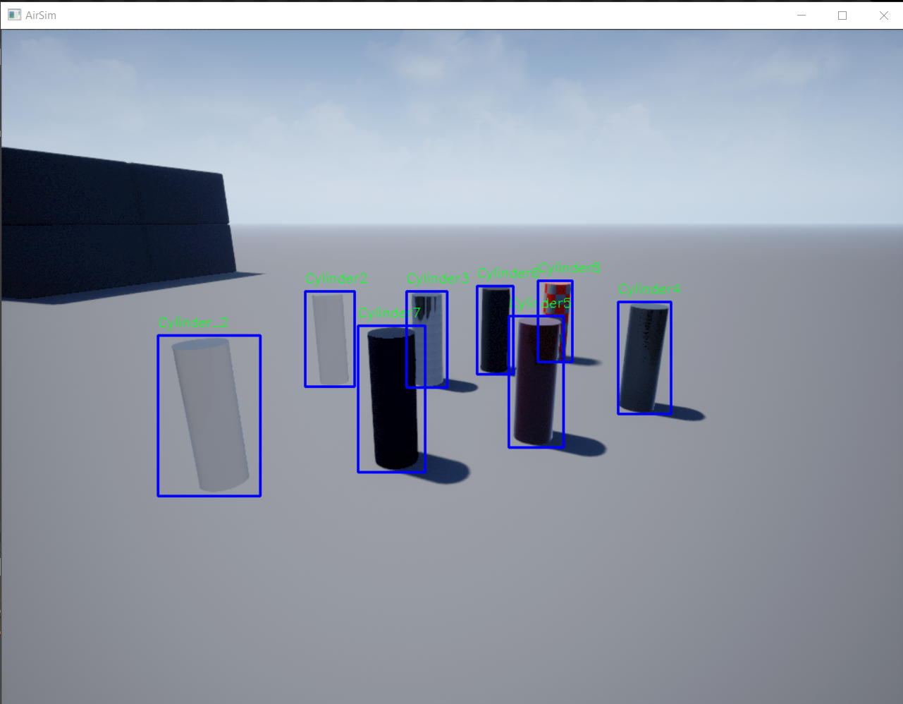

# Object Detection

## About
This feature lets you generate object detection using existing cameras in AirSim, similar to detection DNN.   
Using the API you can control which object to detect by name and radius from camera.   
One can control these settings for each camera, image type and vehicle combination separately.

## API
- Set mesh name to detect in wildcard format   
```simAddDetectionFilterMeshName(camera_name, image_type, mesh_name, vehicle_name = '')```   

- Clear all mesh names previously added   
```simClearDetectionMeshNames(camera_name, image_type, vehicle_name = '')```   

- Set detection radius in cm   
```simSetDetectionFilterRadius(camera_name, image_type, radius_cm, vehicle_name = '')```   

- Get detections   
```simGetDetections(camera_name, image_type, vehicle_name = '')```

Note that if using Annotation camera one has to also give the `annotation_name` argument to choose the right annotation camera.
For example: ```simGetDetections(camera_name, image_type, vehicle_name = '', annotation_name="mygreyscaleannotation")```

The return value of `simGetDetections` is a `DetectionInfo` array:
```python
DetectionInfo
    name = ''
    geo_point = GeoPoint()
    box2D = Box2D()
    box3D = Box3D()
    relative_pose = Pose()
```
## Usage example
Python script [detection.py](https://github.com/microsoft/AirSim/blob/main/PythonClient/detection/detection.py) shows how to set detection parameters and shows the result in OpenCV capture.

A minimal example using API with Blocks environment to detect Cylinder objects:
```python
camera_name = "0"
image_type = airsim.ImageType.Scene

client = airsim.MultirotorClient()
client.confirmConnection()

client.simSetDetectionFilterRadius(camera_name, image_type, 80 * 100) # in [cm]
client.simAddDetectionFilterMeshName(camera_name, image_type, "Cylinder_*") 
client.simGetDetections(camera_name, image_type)
detections = client.simClearDetectionMeshNames(camera_name, image_type)
```

Output result:
```python
Cylinder: <DetectionInfo> {   'box2D': <Box2D> {   'max': <Vector2r> {   'x_val': 617.025634765625,
    'y_val': 583.5487060546875},
    'min': <Vector2r> {   'x_val': 485.74359130859375,
    'y_val': 438.33465576171875}},
    'box3D': <Box3D> {   'max': <Vector3r> {   'x_val': 4.900000095367432,
    'y_val': 0.7999999523162842,
    'z_val': 0.5199999809265137},
    'min': <Vector3r> {   'x_val': 3.8999998569488525,
    'y_val': -0.19999998807907104,
    'z_val': 1.5199999809265137}},
    'geo_point': <GeoPoint> {   'altitude': 16.979999542236328,
    'latitude': 32.28772183970703,
    'longitude': 34.864785008379876},
    'name': 'Cylinder9_2',
    'relative_pose': <Pose> {   'orientation': <Quaternionr> {   'w_val': 0.9929741621017456,
    'x_val': 0.0038591264747083187,
    'y_val': -0.11333247274160385,
    'z_val': 0.03381215035915375},
    'position': <Vector3r> {   'x_val': 4.400000095367432,
    'y_val': 0.29999998211860657,
    'z_val': 1.0199999809265137}}}
```


